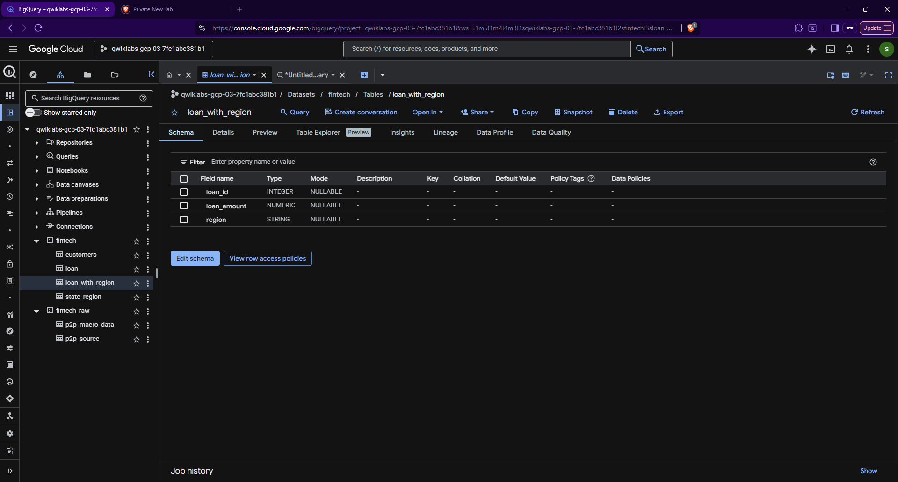
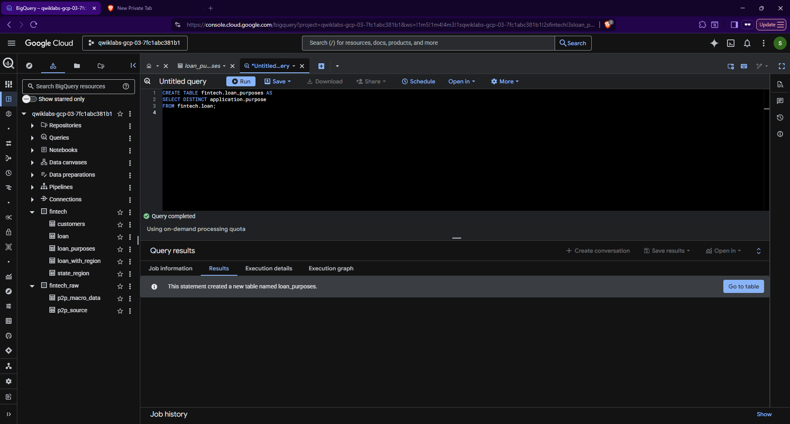
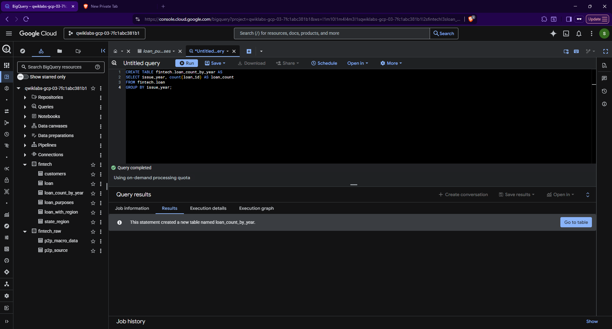
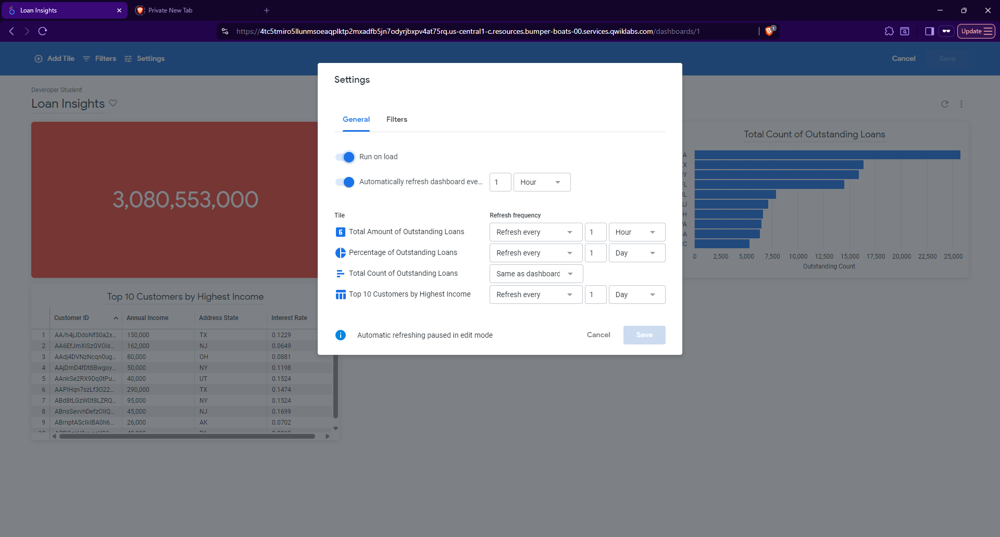
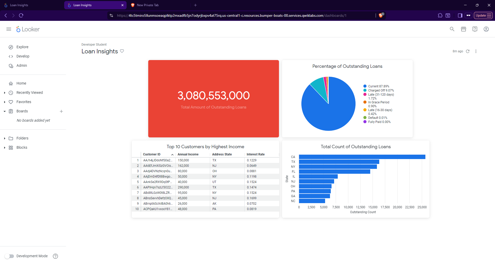

# TheLook Fintech: Cloud-Native Loan Portfolio Analytics 🏦

## 📑 Executive Summary

**Overview**
TheLook Fintech is a growth-stage startup aiming to rapidly scale its lending operations. This repository documents an end-to-end cloud data analytics solution developed to transition the company's Treasury department toward data-driven decision-making. 

**Objective**
The primary goal of this project was to engineer a robust data pipeline using Google BigQuery to ingest, clean, and transform semi-structured loan data. The final output is an automated, self-service Looker Enterprise dashboard that empowers stakeholders to proactively monitor loan portfolio health, track geographic distribution, and analyze year-over-year growth.

## 🛠 Technical Stack
* **Cloud Platform:** Google Cloud Platform (GCP)
* **Data Warehouse:** Google BigQuery
* **Business Intelligence:** Looker Enterprise
* **Languages:** SQL (BigQuery Dialect)

---

## 🏗 The Data Journey

### 1. Data Governance & Ingestion
The foundation of the project required establishing a single source of truth. Raw data was ingested from Google Cloud Storage, and robust schema definitions were applied to ensure data integrity before analysis began.

*Defining the schema structure for the core `fintech.loan` dataset.*

### 2. Advanced SQL Transformations
Real-world fintech data is rarely perfectly formatted. A major component of this project involved processing complex **nested JSON/Struct** fields to extract granular data (like specific loan purposes) and creating optimized reporting tables.

*Extracting granular application purposes from nested JSON structures.*

*Using Create Table As Select (CTAS) to engineer pre-aggregated reporting tables for BI efficiency.*

### 3. Business Intelligence & Activation
To make the data actionable, the transformed BigQuery tables were connected to Looker Enterprise. The dashboard was configured with automatic refresh triggers to ensure stakeholders are always viewing near real-time data.

*Configuring live data refresh parameters within Looker.*

---

## 📊 Results & Business Impact

The culmination of this data pipeline is the **Loan Insights Dashboard**. 

**Key Outcomes:**
1. **Portfolio Visibility:** Treasury can now instantly monitor total outstanding loan balances via a centralized KPI tile using automated `COALESCE` calculations.
2. **Growth Tracking:** Visualized year-over-year loan issue volumes, allowing leadership to easily track the startup's scaling trajectory.
3. **Risk Segmentation:** Developed an interactive geographic heatmap, enabling the team to identify market concentration and regional risk across the US.

## 🚀 Next Steps & Recommendations

* **Recommendation:** Integrate external economic indicators (e.g., regional employment rates) into the BigQuery dataset to enrich the geographic risk analysis.
* **Suggested Next Step:** Configure automated Looker alerts to notify the Treasury team immediately if the "Outstanding Loans" metric exceeds a predefined safety threshold in any specific subregion.
